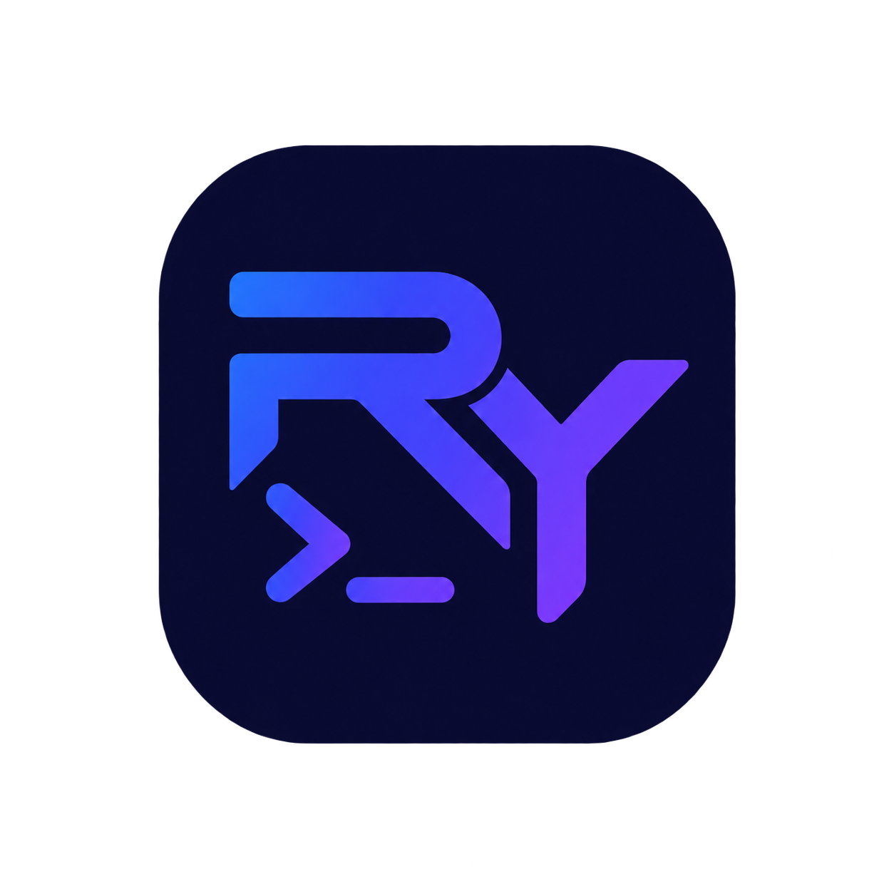

# RYterminal

  

> Entorno web interactivo para aprender, practicar y experimentar con sistemas, redes y herramientas informáticas.

RYterminal es una plataforma web 100% frontend diseñada como un entorno de trabajo técnico para estudiantes de informática y personas que quieren practicar conceptos de sistemas, redes y desarrollo.

La aplicación reúne diferentes herramientas y simuladores en un único espacio, sin necesidad de instalar software adicional ni utilizar servicios externos.

## Características

### Terminal

Terminal simulada con diferentes entornos:

* Linux
* Windows CMD
* PowerShell
* Sistema de archivos virtual
* Comandos simulados
* Biblioteca de comandos
* Retos prácticos
* Redirecciones y pipes
* Errores similares a los de una terminal real

La terminal es completamente simulada y no ejecuta comandos reales en el sistema operativo.

### Simulador de redes

Entorno visual para experimentar con conceptos básicos de redes:

* PC
* Laptop
* Servidor
* Switch
* Router
* Conexiones mediante cables
* Direcciones IPv4
* Máscaras de red
* Puertas de enlace
* DNS
* Tablas MAC
* Tablas de enrutamiento
* Simulación de Ping
* Visualización de paquetes
* Exportación e importación de topologías

### Sistemas numéricos

Conversión entre:

* Decimal
* Binario
* Octal
* Hexadecimal

Incluye conversiones bidireccionales y explicación paso a paso.

### Conversor ASCII

Conversión entre texto, ASCII decimal, binario y hexadecimal.

Permite trabajar con caracteres individuales y frases completas.

### Calculadora de almacenamiento

Conversión entre diferentes unidades de almacenamiento:

* Bit
* Byte
* KB / KiB
* MB / MiB
* GB / GiB
* TB / TiB
* PB / PiB

Incluye la diferencia entre el sistema decimal (1000) y el sistema binario (1024).

### Conversor de unidades IT

Conversor de unidades relacionadas con informática:

* Velocidad de red
* Transferencia de datos
* Frecuencia
* Tiempo

Por ejemplo:

`100 Mbps = 12,5 MB/s`

### HTML Live

Editor HTML, CSS y JavaScript con vista previa en tiempo real.

Incluye:

* Editor de código
* Vista previa
* Ejecución local
* Formateado
* Importación y exportación
* Sandbox para la ejecución

### XML Studio

Herramienta para trabajar con documentos XML:

* Validación
* Formateado
* Minificado
* Árbol XML
* Detección de errores
* Búsqueda
* Importación y exportación

### JSON Studio

Herramienta para trabajar con documentos JSON:

* Validación
* Formateado
* Minificado
* Árbol de datos
* Búsqueda
* Detección de errores
* Importación y exportación

---

## Filosofía del proyecto

RYterminal está diseñado como un entorno técnico y no simplemente como una colección de pequeñas herramientas independientes.

El objetivo es reunir herramientas relacionadas con sistemas, redes y desarrollo en un espacio común y coherente, creando una especie de centro de trabajo informático accesible directamente desde el navegador.

---

## Tecnologías

RYterminal está desarrollado principalmente con:

* HTML5
* CSS3
* JavaScript
* DOM
* LocalStorage
* SVG
* Canvas
* APIs nativas del navegador

El proyecto no requiere:

* Backend
* Base de datos
* API externa
* Tokens
* Servicios de IA
* Servidor propio

Toda la lógica se ejecuta en el navegador.

---

## Inteligencia artificial como apoyo

El desarrollo de RYterminal se ha realizado con apoyo de herramientas de inteligencia artificial.

La IA se ha utilizado como herramienta de asistencia durante el desarrollo para:

* Generación y revisión de código
* Resolución de errores
* Propuestas de arquitectura
* Diseño y mejora de interfaces
* Desarrollo de funcionalidades
* Documentación
* Análisis y depuración

El proyecto, sus funcionalidades, decisiones de diseño y evolución han sido supervisados y dirigidos por el autor.

El uso de IA forma parte del proceso de desarrollo, pero no sustituye la comprensión, revisión y validación del código utilizado en el proyecto.

---

## Seguridad y privacidad

RYterminal funciona completamente en el lado del cliente.

No requiere crear una cuenta ni enviar información a un servidor.

La terminal es una simulación y no tiene acceso al sistema operativo real.

Los datos utilizados por las herramientas permanecen en el navegador, salvo que el usuario decida exportarlos o compartirlos.

---

## Ejecución

RYterminal puede utilizarse directamente desde un navegador.

### Demo

[Ver RYterminal](https://ryterminal.netlify.app/)

### Ejecución local

Descarga el repositorio desde **Code → Download ZIP** en GitHub.

Después, descomprime el archivo y abre `index.html` en el navegador.

No es necesario instalar dependencias.

---

## Objetivos

RYterminal nació como un proyecto personal relacionado con mis estudios de Administración de Sistemas Informáticos en Red (ASIR).

Los principales objetivos son:

* Practicar JavaScript y desarrollo frontend.
* Mejorar conocimientos de sistemas.
* Practicar conceptos de redes.
* Crear herramientas educativas propias.
* Experimentar con simulaciones informáticas.
* Diseñar interfaces técnicas y funcionales.
* Construir un proyecto real que pueda seguir ampliando.

---

## Próximamente

El proyecto puede seguir ampliándose con nuevas funcionalidades relacionadas con:

* Sistemas
* Redes
* Desarrollo
* Bases de datos
* Ciberseguridad
* Administración de sistemas
* Herramientas educativas

---

## Autor

Desarrollado por Alejandro Raya.

Proyecto personal creado durante mi formación en Administración de Sistemas Informáticos en Red (ASIR).

---
---

## Derechos de autor

Copyright © 2026 Alejandro Raya. Todos los derechos reservados.

Este repositorio se publica con fines educativos, de demostración y como portfolio personal.

El código, diseño y contenido de RYterminal no se publican bajo una licencia de software libre. No se autoriza la copia, modificación, redistribución o reutilización del proyecto o de partes sustanciales de su código sin permiso del autor.
